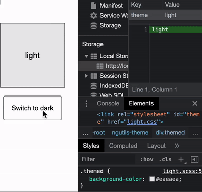

# @ngbasics/theme-selector

Switch global styles at runtime.



---

## Preparation

Build your stylesheets:

```scss
// src/themes/dark.scss
body {
  background-color: black;
  color: white;
}

// src/themes/light.scss
body {
  background-color: white;
  color: black;
}
```

Add to `angular.json` (dev-server needs to be restarted):

```json
"styles": [
  "src/styles.scss",
  {
    "bundleName": "dark", // <- produces 'dark.css'
    "input": "src/themes/dark.scss",
    "inject": false
  },
  {
    "bundleName": "light",
    "input": "src/themes/light.scss",
    "inject": false
  }
]
```

---

## Usage

### Configure the Module:

Add a link-tag to your `index.html` and provide a selector to the config.

```html
<!-- index.html -->
<link rel="stylesheet" id="theme" href="dark.css" />
```

```ts
// app.module.ts
const themeConfig: ThemeSelectorConfig = {
  selector: () => querySelector('#theme'),
};

@NgModule({
  imports: [ThemeSelectorModule.forRoot(themeConfig)],
})
export class AppModule {}
```

Alternatively, if it doesn't matter whether the initial style is loaded asynchronously or not, you can provide it's name in the config and let the service inject it into your html.

```ts
type Theme = 'light' | 'dark';

@NgModule({
  imports: [ThemeSelectorModule.forRoot<Theme>({ initialTheme: 'dark' })],
})
export class AppModule {}
```

### Use the service:

```ts
@Component({
  selector: 'app-theme',
  template: `<div>{{ themeService.theme$ | async }}</div>
    <button (click)="themeService.selectTheme('dark')">dark</button>
    <button (click)="themeService.selectTheme('light')">light</button>`,
})
export class ThemeComponent {
  constructor(public themeService: ThemeSelectorService<Theme>) {}
}
```

---

## Persistence

By default the selected theme is NOT persisted.

If you want to persist the selection provide a storage to the config:

```ts
const themeConfig: ThemeSelectorConfig = {
  storage: localStorage,
};
```

The storage must implement the `Storage` interface.
